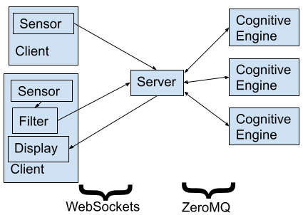

# Gabriel Design

The primary purpose of these libraries is to transmit data from mobile devices
to cloudlets. Wearable Cognitive applications require responses shortly after a
user completes a step, so
we always want to process the newest frame possible. We never want to build up
a queue of stale data to process. The library accomplishes this using a flow
control mechanism similar to the one proposed in our
[2014 paper](https://elijah.cs.cmu.edu/DOCS/ha-mobisys2014.pdf). Our
implementation allows multiple clients to share one cloudlet.

We use the abstractions of "sources" and "cognitive engines." A source is
anything that produces data on a mobile device. It could be a stream from a
sensor such as a camera or microphone. A source might also be a filter that runs
on the device, analyzes all frames produced by a sensor, but then only forwards
some of these frames to the
cloudlet. We use the term "early discard" to refer to filters like
this. A cognitive engine runs on a cloudlet and processes data. A cognitive
engine will process one frame of data at a time. A frame could be a single
image, a short clip of audio and/or video, or set of readings from a different
type of sensor.

Our framework supports workloads with multiple sources and multiple
cognitive engines. Multiple cognitive engines may consume data from the same
source, but we restrict each cognitive engine to consuming data from one source.
This reduces the complexity of cognitive engines.

Cognitive engines are all implemented in Python. Developers implement a single
function that takes a frame as its input parameter and returns a list of
results when it completes. Cogitive engines that do not need to return results
to mobile devices can just return an empty list. Our flow control mechanism is
based on tokens. Clients have a set of tokens for every source. When a client
sends a frame to the cloudlet, it gives up a token for this source. The cloudlet
returns the relevant token when the function processing the frame returns.
A client will drop all frames from a source, until it gets a token for this
source. Clients and
cloudlets communicate using the The
[WebSocket Protocol](https://datatracker.ietf.org/doc/html/rfc6455), which is
built on TCP. Therefore, tokens will never be lost due to packet loss.

Applications that are very latency sensitive should be run with a single token
per source.
Applications that can tolerate higher latency can be run with more tokens.
Using multiple tokens
will allow frames to be transmitted while the cloudlet is busy processing other
frames. However, this may also cause frames to be buffered on the cloudlet, if
the
cognitive engine takes a long time to process earlier frames. As a result, there
might be a significant amount of time between when a frame is captured and when
it gets processed. However, using multiple tokens avoids periods where the
cloudlet has to wait to receive the next frame. Increasing
the number of tokens thus increases the possible dealy before a frame gets
processed but reduces the amount of time the cloudlet has no frames to process,
when network latency is high. The number of rames is thus a parameter that will
increase the framerate for applications that can tolerate higher latency.

When multiple cognitive engines consume frames from the same source, the token
for a frame is returned when the first cognitive engine finishes processing the
frame. A Client will only recieve a result from the first cognitive engine that
finishes processing a frame, and it will not get additional results or tokens
when other engines finish processing the same frame. Developers should thus only
have multiple cognitive engines consume frames from the same source when these
engines store results and do not have to send something back to the client.

Our server library keeps a
queue of input frames for each source. When multiple clients produce frames from
the same source, such as two smartphones both capturing images with a camera,
these frames are put into the same queue. A cognitive engine will process the
frame at the head of the queue for the source it consumes frames from. This
frame will be left at the head of the queue, so other cognitive engines that
consume frames from the same source will also process it. This frame is only
removed from the queue when a cognitive engine finishes processing it. The
engine that finishes processing the frame at the head of the queue will be the
first to get the next frame in the queue (if there is one).

This mechanism ensures that frames get consumed at the
rate that the fastest cognitive engine can process them. If every cognitive
engine took a frame from the queue without leaving it for other engines, a
slower engine would process frames that the fastest engine does not.
This method also ensures that cognitive engines do not get stale
frames because they are slow. Cognitive engines always process the frame at the
head of the queue. If one engine is slow, and the queue gets advanced several
times while the slow engine is processing a single frame, the slow engine
ignores the frames it missed and just processes the frame that is currently at
the head of the queue.

Many applications will only need a single cognitive engine. Our server code
runs workflows like this as a single Python program. A WebSocket server is run
in the main process, and the cognitive engine is run in a separate process using
Python's multiprocessing module. Inter-process communication is done using the
multiprocessing module's Pipe function. For workloads that require multiple
cognitive engines (such as the one depicted below,
the WebSocket server is run as a standalone Python program and each cognitive
engine is run as a separate program. The programs communicate
with each other using [ZeroMQ](https://zeromq.org/).

We have developed client libraries for Python and Android. These include
networking componenets that communicate with our server code using WebSockets.
The libraries also contain functions to capture images with a camera and
transmit the latest frame whenever a token is available. The Python library uses
[OpenCV](https://opencv.org) to capture images while the Android library uses
[CameraX](https://developer.android.com/training/camerax).
